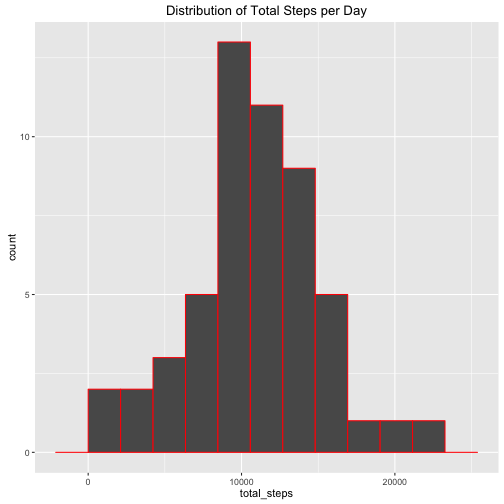
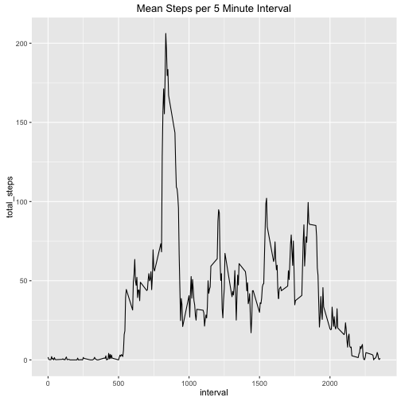
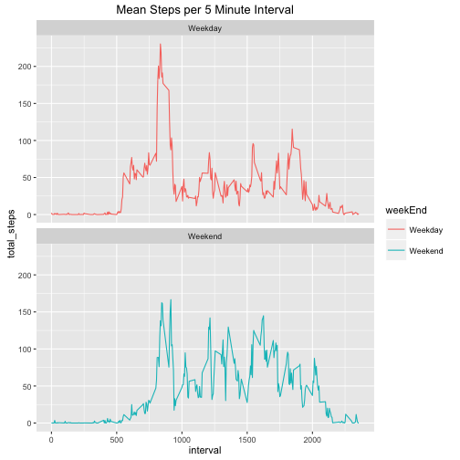

## Part 1

Load the data and the required packages. For this assignment I used ggplot2, dplyr, and tidyr. ggplot2 is for the figure development whil dplyr and tidyr are used for data wrangling. 


##Part 2

Develop a histogram that shows the distribution of total steps per day. 


```r
require(ggplot2)
require(dplyr)
require(tidyr)
activity$date <- as.Date(activity$date)
activity <- subset(activity,!is.na(steps))
activityDay <- group_by(activity,date) %>% summarise(total_steps = sum(steps))
ggplot(data=activityDay,aes(x=total_steps))+geom_histogram(bins = 10,col="red")+ggtitle("Distribution of Total Steps per Day")
```



##Part 3

Mean and median number of steps taken each day


```r
summary(activityDay$total_steps) 
```

```
##    Min. 1st Qu.  Median    Mean 3rd Qu.    Max. 
##      41    8841   10760   10770   13290   21190
```

## Part 4

Time series plot of the average number of steps taken. From the graph you can see their is a spike in the number of steps in the morning. 


```r
require(ggplot2)
require(dplyr)
require(tidyr)
activityInt <- group_by(activity,interval) %>% summarise(total_steps = mean(steps))
ggplot(data=activityInt,aes(x=interval,y=total_steps))+geom_line()+
  ggtitle("Mean Steps per 5 Minute Interval")
```



## Part 5

The 5-minute interval that, on average, contains the maximum number of steps. Arranging the file and providing the first ten shows the top intervals. That data show that the most steps are recorded at the 8:35 interval. 


```r
require(ggplot2)
require(dplyr)
require(tidyr)
head(arrange(activityInt,desc(total_steps)))
```

```
## Source: local data frame [6 x 2]
## 
##   interval total_steps
##      (int)       (dbl)
## 1      835    206.1698
## 2      840    195.9245
## 3      850    183.3962
## 4      845    179.5660
## 5      830    177.3019
## 6      820    171.1509
```


## Part 6

Code to describe and show a strategy for imputing missing data. To replace the missing data I first identified the rows. Then I replaced NA with the the average steps for that interval.


## Part 7 

Histogram of the total number of steps taken each day after missing values are imputed. Replotted the histogram. The data look roughly the same. 


```r
# load required packages
require(ggplot2)
require(dplyr)
require(tidyr)

activityNew <- subset(activityNew,!is.na(steps))
activityDay <- group_by(activityNew,date) %>% summarise(total_steps = sum(steps))
ggplot(data=activityDay,aes(x=total_steps))+geom_histogram(bins = 10,col="red")+
  ggtitle("Distribution of Steps with Missing data replaced")
```


## Part 8

Panel plot comparing the average number of steps taken per 5-minute interval across weekdays and weekends. The steps on weekends are more evenly distributed throughout the day. 


```r
# load required packages
require(ggplot2)
require(dplyr)
require(tidyr)

# Part 8
#Identify Weekday
activityNew$dow<-format(activityNew$date,
                     format = "%A")
#Identify Weekend/Weekday feature
activityNew$weekEnd <- ifelse(activityNew$dow=="Saturday","Weekend",
                              ifelse(activityNew$dow=="Sunday","Weekend","Weekday"))

#Panel Plot
activityIntWeekend <- group_by(activityNew,weekEnd,interval) %>% summarise(total_steps = mean(steps))
d<-ggplot(data=activityIntWeekend,aes(x=interval,y=total_steps,color=weekEnd))+
            geom_line()+
            facet_wrap(~weekEnd,nrow = 2,ncol = 1)+
            ggtitle("Mean Steps per 5 Minute Interval")
ggsave(d,file="Figures/stepIntervalWeekend.png",height = 6,width = 6)
```




